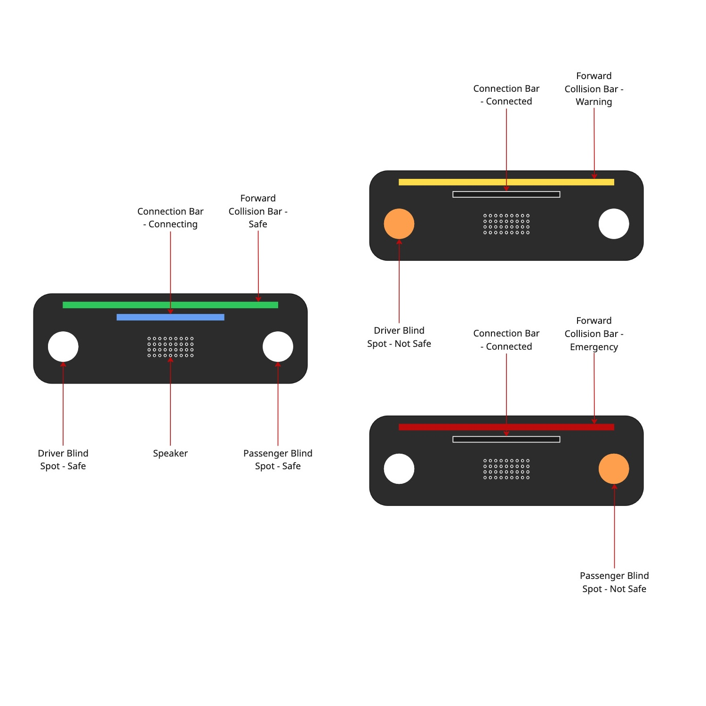

# FSU Spring 2026 Capstone

## Helpful Links
#### [yolov8](https://yolov8.com/#what-is)

#### [Model Inferencing](https://medium.com/@achyutpaudel50/yolov8-train-and-inference-detection-or-segmentation-on-custom-data-using-roboflow-481c8d27445d)

#### [Video Processing](https://opencv.org/blog/reading-and-writing-videos-using-opencv/)

## Examples
- [https://github.com/tawnkramer/CarND-Vehicle-Detection](https://github.com/tawnkramer/CarND-Vehicle-Detection)
- [https://www.youtube.com/watch?v=FdZvMoP0dRU](https://www.youtube.com/watch?v=FdZvMoP0dRU)

## Training Data
COCO did not perform well, try:
- **BDD100K**:
  - http://bdd-data.berkeley.edu/download.html
    - `100k Images`
    - `Labels`
- **KITTI**
- **Waymo Open Dataset**

## Hardware
- Raspberry Pi 5 4Gb
- Camera Module 3 - Wide NoIR
- Adafruit Ultimate GPS HAT
- Raspberry Pi AI HAT+ 13 TOPS
- LEDs
- Speaker

## Design

Raspberry Pi 5 4Gb
- 85 x 56 x 16 (mm)

Camera Module 3 - Wide NoIR
- 25 × 24 × 12.4 (mm)

Adafruit Ultimate GPS HAT
- 65 x 56 x 7 (mm)

Raspberry Pi AI HAT+ 13 TOPS
- 



---

## Implementation Additions

Dashcam assistant prototype with a Python GUI for reviewing captured media, configurable user settings, and early light-level processing utilities for capture behavior.

## Current MVP Scope

- Desktop review GUI for dashcam media (`clips`, `photos`, `long_form`)
- Configurable settings persisted to disk
- In-memory frame/file cache utility
- Light-level estimation pipeline with day/night capture profile selection

## Project Structure

- `src/main_review_gui.py`: GUI entry point
- `src/gui/video_review.py`: Tkinter application
- `src/service.py`: media folder management and file opening behavior
- `src/settings.py`: user settings persistence
- `src/cache.py`: bounded cache
- `src/image_processing/`: light-level and processing helpers
- `assignments/`: milestone and planning notes

## Setup

1. Create and activate a virtual environment.
2. Install dependencies:

```bash
pip install -r requirements.txt
```

## Run

Launch the GUI:

```bash
python -m src.main_review_gui
```

At first launch, the app creates a `dashcam/` root folder with:

- `dashcam/clips`
- `dashcam/photos`
- `dashcam/long_form`

Use the **Choose Root** button to switch to your real media directory.

## Light-Level Processing

`src/image_processing/processor.py` includes a simple brightness-based classifier:

- `night`
- `morning`
- `day`
- `afternoon`

It can read an image, estimate brightness, and return a classification. It can also choose a Raspberry Pi capture profile (day/night) through `src/image_processing/light_level.py`.

## Notes on Platform Support

- GUI and core project structure run on Windows/macOS/Linux.
- Raspberry Pi camera controls (`libcamera`) are optional and handled with non-Pi-safe fallbacks for development environments.

## Suggested Demo Flow

1. Start the app and select a media root.
2. Browse categories and open files/folders from the GUI.
3. Open **Settings**, adjust values, save, and relaunch to verify persistence.
4. Show one sample image passed through `Processor.process_image_path()` and print detected light level.

## Hardware Target

- Raspberry Pi 5 (4GB or 8GB)
- Camera Module 3 Wide NoIR
- Raspberry Pi AI HAT+ 13 TOPS
- Adafruit Ultimate GPS HAT
- Speaker and status LEDs

## Helpful Links

- [YOLOv8](https://yolov8.com/#what-is)
- [Model Inferencing Tutorial](https://medium.com/@achyutpaudel50/yolov8-train-and-inference-detection-or-segmentation-on-custom-data-using-roboflow-481c8d27445d)
- [OpenCV Video Processing](https://opencv.org/blog/reading-and-writing-videos-using-opencv/)
- [CarND Vehicle Detection Example](https://github.com/tawnkramer/CarND-Vehicle-Detection)